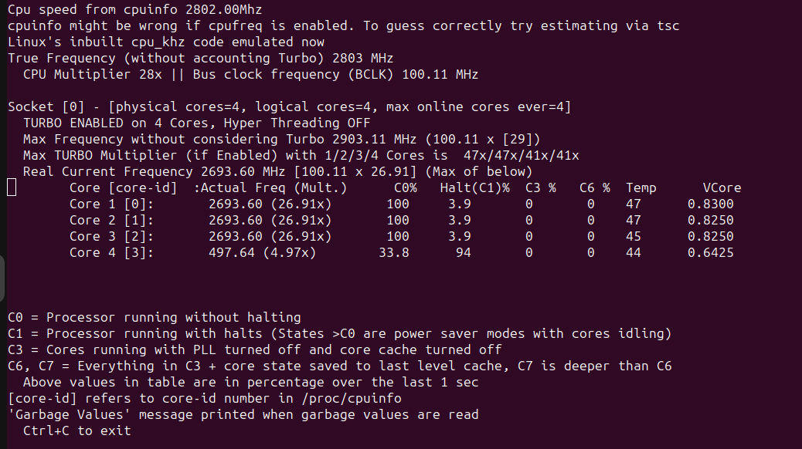
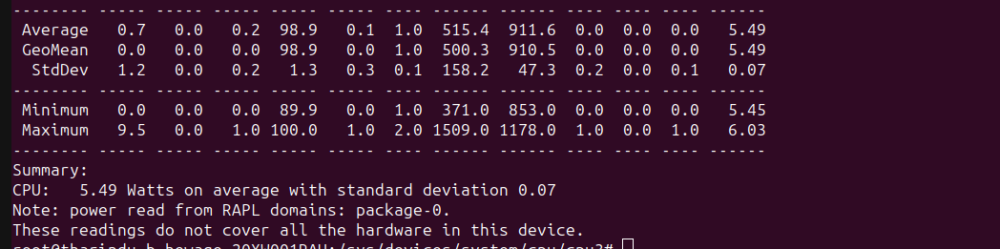
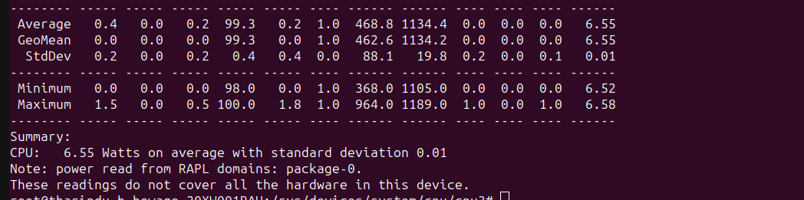

# core-power-mgt


A CPU-core power management microservice.

This service wraps the [Intel Power Optimization Library](https://github.com/intel/power-optimization-library) to 
manage per-core power features of intel processors. However, APIs are designed to be generic enough, such that future
support for different vendors would be seamless for the end-user. Current APIs supports,

- Grouping cores into high-performance and dynamic pools
- Changing status of dynamic pool to idle (minimum power consumption) to high performance, and vice-versa.

###### Limitations

Current implementation expects below requirements.

- Linux-based operating system
- Intel processor with core idle-states and dynamic frequency scaling support.
    - Current impl. expects a four core CPU (hyper-threading disabled) with four c-states support (`POLL, C1_ACPI, C2_ACPI, C3_ACPI`)
- Linux idle driver must be `intel_idle`

Current implementation creates the below configuration.
- Out of four cpu cores, first three are high-performance cores
    - Clock frequency is fixed on `2.6 Ghz`
    - Cores will never go idle (idle state is always set to `POLL`)
- Power management of the remaining core is supported via APIs

These limitations will be fixed as project evolves.

###### Project goals

Evolve towards supporting fine-grained core power management through APIs; core-grouping, setting power profiles, per-
core power management.

### Build & run

Service can be started by building the binary for the target env. and running it.

Execute below. Make sure to replace placeholders values for the target environment.

`GOOS=<target-operating-system> GOARCH=<target-cpu-architecture> go build -gcflags="-N -l" -o gc-controller`

For example, below will build the service for linux env. with `amd64` cpu.

`GOOS=linux GOARCH=amd64 go build -gcflags="-N -l" -o gc-controller`

Run the service with `./gc-controller` command (tested on linux - might change for other envs).

### Supported APIs

- `/gc-controller/sleep`
    - Put the core to the sleep mode. 
    - Notice: `count` parameter support is not yet implemented.
    - ```
      curl --location --request PUT 'http://localhost:3000/gc-controller/sleep' \
      --header 'Content-Type: application/json' \
      --data '{
      "count": 2
      }'
      ``` 
- `/gc-controller/wake`
    - Put the core to the woken mode.
    - Notice: `count` parameter support is not yet implemented.
    - ```
      curl --location --request PUT 'http://localhost:3000/gc-controller/wake' \
      --header 'Content-Type: application/json' \
      --data '{
      "count": 2
      }'
      ```
- `/gc-controller/perf`
    - Change the operating frequency of the core.
    - ```
      curl --location --request PUT 'http://localhost:3000/gc-controller/perf' \
      --header 'Content-Type: application/json' \
      --data '{
      "f-mhz": 2600
      }'
      ```

### Tested on
- Development was done in MacOS, and tested on Lenovo ThinkPad X1 Carbon X1 Gen 9 with Intel Core i7-1165G7
  (4 cores - hyper-threading disabled).
- Tested env was Ubuntu 23.04 with Linux kernel 6.2.0-39-generic

### Verification

The following sections explain the verification steps carried out.

#### Deployment

Execute [build-debug.sh](../build-debug.sh) script. It builds the service for linux and amd64 cpu architecture, tests,
and deploy the service binary to a remote dev
environment via SSH. The authentication details to perform this is injected via inline environment variables. An
example execution looks like below.

- Template:`REMOTE_IP=<remote-ip> REMOTE_USER=<remote-user> sh build-debug.sh`
- Say remote ip is 10.12.13.5, and user is ubuntu,
    - `REMOTE_IP=10.12.13.5 REMOTE_USER=ubuntu sh build-debug.sh`

ps: For any other environment, the script needs to be modified (ex: for linux with arm64, the
env vars of app building command needs to be changed appropriately)

#### Remote debug

The same script also deploys the script: [run-at-remote-for-debug.sh](../run-at-remote-for-debug.sh), which
uses delve to support remote debugging. Remote debugging is tested for Goland IDE by following the steps from
https://www.jetbrains.com/help/go/attach-to-running-go-processes-with-debugger.html. Might want to create an SSH tunnel
to avoid configuring the network for ip discovery (`ssh -L 3000:localhost:3000 <remote-ip>`).

Since the service binary involves os userspace modifications, it needs sudo privileges. Therefore, if the debugging
script is run with sudo, then PATH env. var of sudo session must point to the delve binary. One way to achieve this is
install golang and then install delve via go tool and then modify PATH var in sudo session to point the delve binary
in `/home/<user>/go/bin`.

#### Execution

Intel power library is the core driver of this service. It requires sudo privileges to modify `sysfs`, thus gc-controller
binary needs to run with sudo.

`sudo ./gc-controller`

#### Verification

1. **Configure remote env for monitoring:** We use multiple different tools because i7z reads directly from CPU, thus ACPI related c-state
   information are not visible.
    1. **Frequency scaling:**
        1. Install i7z via `sudo apt-get install i7z`
        2. Start monitoring `sudo i7z`
    2. **Core sleep:**
        1. Install turbostat via `sudo apt-get install turbostat`
        2. Start monitoring `turbostat --show Core,POLL%,C1ACPI%,C2ACPI%,C3ACPI%,CPU%c1,CPU%c6,CPU%c7,PkgWatt,CorWatt,Busy%`
    3. **CPU power:**
        1. Install powerstat via `sudo apt-get install powerstat`
        2. We will monitor the effect later.
2. Perform test:
    1. Start the service `sudo ./gc-controller`.
        1. **What is does:** pool first three cores (`0,1,2`) as fully awake (`POLL` state)regulars and set its frequency to `2.8Ghz` -> Higher
           performance pool of cores supporting most workloads including latency critical tasks. Last core is set as a
           Green Core and initialized to the deepest possible sleep state (`C3_ACPI`) and its performance is degraded to
           a low value (`core frequency is less than 500 Mhz`).
        2. **Verification:** i7z shows actual frequency values as expected, and turbostat verifies sleep states.
           
           
    2. Run powerstat tool to collect CPU power through RAPL `sudo powerstat -R`
    3. Wake up the green core via `curl --location --request PUT 'http://localhost:3000/gc-controller/wake' \
       --header 'Content-Type: application/json' \
       --data '{
       "count": 2
       }'` and make it high perf via `curl --location --request PUT 'http://localhost:3000/gc-controller/perf' \
       --header 'Content-Type: application/json' \
       --data '{
       "f-mhz": 2600
       }'`
    4. Re-run powerstat tool to collect CPU power through RAPL `sudo powerstat -R`
    5. Compare two power results. With the core turned off, it should save about ~1 watt of power.
       
       
#### Post-cleanup

The changed states will persist even after service is stopped. Therefore, it's recommended to restart the system, such
that normal operation is resumed.

